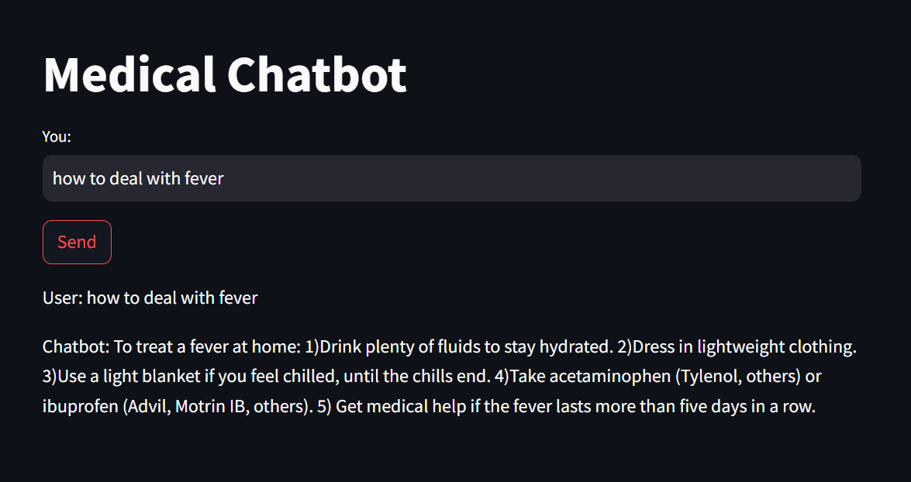
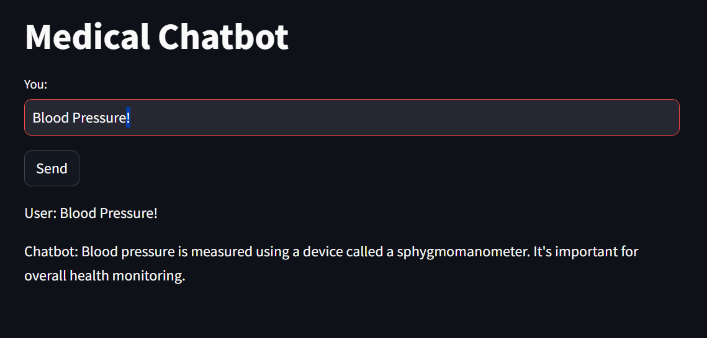
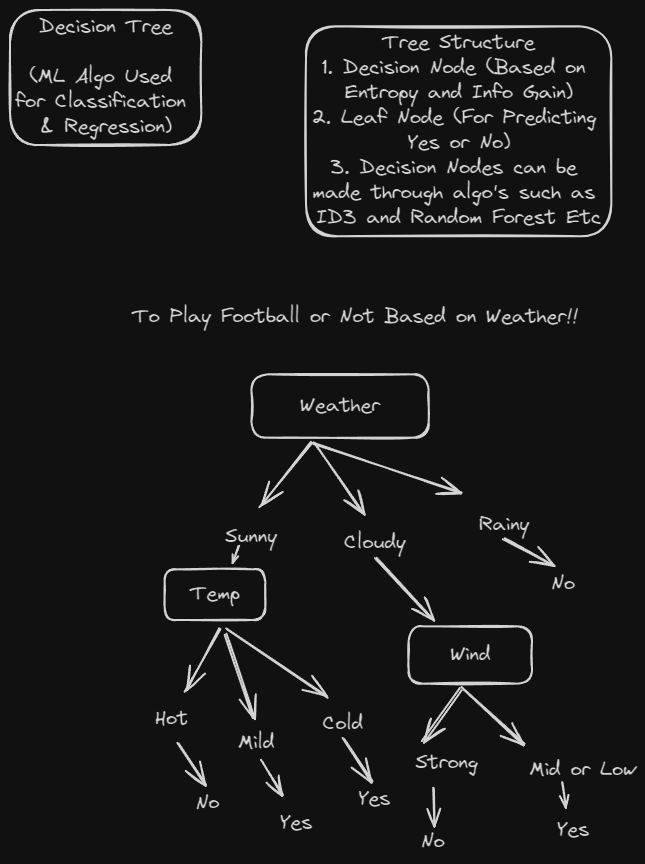
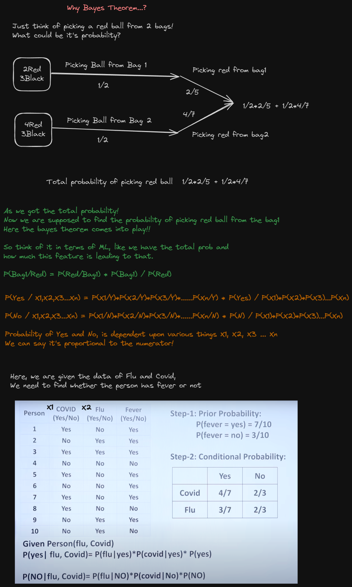

## Medical Chatbot Using NLP ~ NLTK Library

This project implements a medical chatbot using Natural Language Processing (NLP) techniques and machine learning classifiers. The chatbot is designed to interact with users, understand their queries, and provide relevant responses related to medical topics.

### Functionalities Covered:

### Preprocessing Stage:
- **Convert Text to Lowercase:** Ensures uniformity in text processing by converting all characters to lowercase.
- **Tokenize Text:** Breaks down text into individual words or tokens for further analysis.
- **Remove Stopwords:** Eliminates common words like "and", "the", etc., which do not contribute significantly to the meaning of the text.

### Feature Extraction:
- **Tagging (POS Tagging):** Assigns part-of-speech tags to words in the text to understand their grammatical roles and usage.
- **Stemming:** Reduces words to their root forms by removing suffixes or prefixes to simplify analysis.
- **Lemmatization:** Transforms words into their base or dictionary forms for consistency and improved analysis accuracy.

### Model Training:
- **Decision Tree Classifier:** Learns decision rules from the training data to classify user inputs into predefined categories.
- **Naive Bayes Classifier:** A probabilistic classifier based on Bayes' theorem that predicts the category of a given input using training data.

### User Interface:
- **Streamlit Integration:** created a user-friendly interface for interacting with the chatbot. Users can input their queries, and the chatbot responds accordingly.

### Theorems used for Classification

